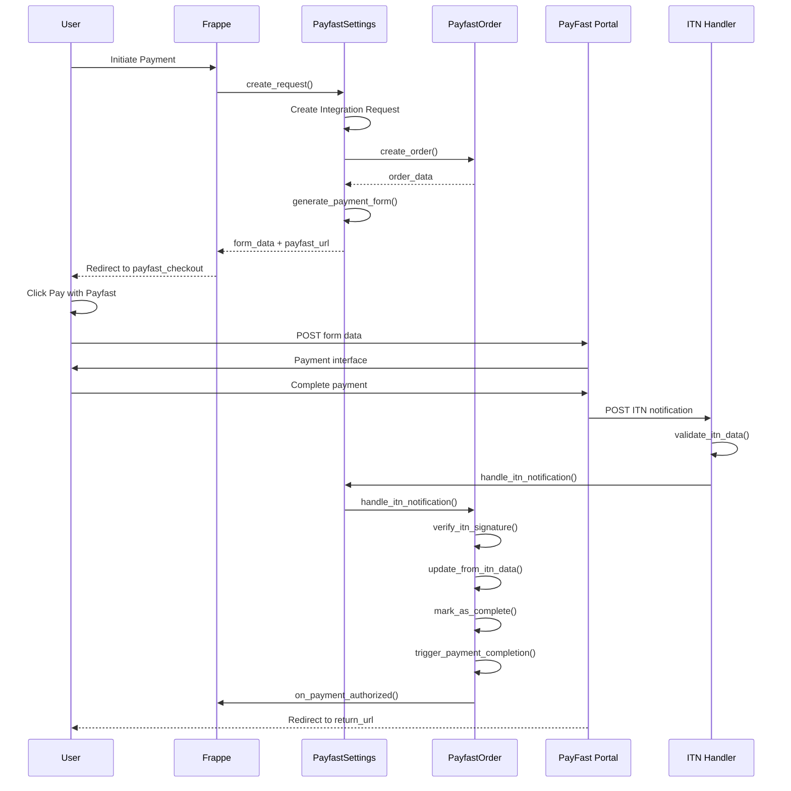

# PayFast Payment Gateway Integration Analysis

**Date:** 2025-10-01  
**Status:** Implementation Complete - Validation Required  
**Documentation:** https://developers.payfast.co.za/docs

## Executive Summary

The PayFast payment gateway has been implemented in the Frappe payments app following ERPNext compliance patterns. The implementation includes ITN (Instant Transaction Notification) handling, signature verification, and transaction tracking. However, it has not been tested and requires validation against PayFast's official documentation and comparison with working implementations like Stripe and Mpesa.

---

## Implementation Overview

### Core Components

1. **PayFast Settings** ([`payfast_settings.py`](development-bench/apps/payments/payments/payment_gateways/doctype/payfast_settings/payfast_settings.py))
   - Main controller for PayFast integration
   - Handles payment gateway registration
   - Manages credentials (merchant_id, merchant_key, passphrase)
   - Generates payment form data
   - Supports sandbox and production modes

2. **PayFast Order** ([`payfast_order.py`](development-bench/apps/payments/payments/payment_gateways/doctype/payfast_order/payfast_order.py))
   - Transaction tracking doctype
   - Stores order details and ITN data
   - Handles signature verification
   - Manages payment status lifecycle (Pending → Complete/Failed/Cancelled)

3. **ITN Handler** ([`payfast_itn.py`](development-bench/apps/payments/payments/payment_gateways/payfast_itn.py))
   - Processes Instant Transaction Notifications from PayFast
   - Validates ITN data and signatures
   - Updates order status and triggers payment completion
   - Registered as webhook endpoint: `/payments/payfast_itn`

4. **Checkout Pages** ([`payfast_checkout.py/.html/.js`](development-bench/apps/payments/payments/templates/pages/))
   - User-facing payment initiation page
   - Displays payment details
   - Redirects to PayFast payment portal

---

## Payment Flow Architecture



---

## Comparison with Reference Implementations

### Stripe Implementation Patterns

| Feature | Stripe | PayFast | Status |
|---------|--------|---------|--------|
| Integration Request | ✅ Single tracking | ✅ Dual tracking (IR + Order) | ⚠️ More complex |
| Payment Flow | Direct API call | Form POST redirect | ✅ Different but correct |
| Webhook Handler | ✅ Dedicated | ✅ Dedicated (ITN) | ✅ Implemented |
| Signature Verification | ✅ Yes | ✅ Yes | ✅ Implemented |
| Error Handling | ✅ Comprehensive | ✅ Comprehensive | ✅ Good |
| Status Updates | ✅ Via webhook | ✅ Via ITN | ✅ Implemented |

### Mpesa Implementation Patterns

| Feature | Mpesa | PayFast | Status |
|---------|-------|---------|--------|
| Transaction Tracking | ✅ Integration Request | ✅ IR + PayFast Order | ⚠️ More complex |
| Callback Handling | ✅ Realtime publish | ✅ Status update | ✅ Different approach |
| Signature Verification | ✅ Yes | ✅ Yes | ✅ Implemented |
| Custom Connector | ✅ MpesaConnector class | ❌ Not needed | ✅ N/A for PayFast |
| Multiple Requests | ✅ Handles splits | ❌ Single request | ✅ Simpler |

---

## Implementation Strengths

### ✅ Well-Implemented Features

1. **ERPNext Compliance**
   - Follows Integration Request pattern
   - Uses `create_request_log()` from frappe.integrations.utils
   - Proper payment gateway registration via `create_payment_gateway()`
   - Implements required methods: `validate_transaction_currency()`, `validate_minimum_transaction_amount()`

2. **Security**
   - MD5 signature generation and verification
   - Passphrase support for enhanced security
   - Signature verification at multiple levels
   - Proper error logging

3. **Transaction Tracking**
   - PayFast Order doctype provides detailed transaction history
   - Stores ITN data in meta_data field for audit trail
   - Status tracking: Pending → Complete/Failed/Cancelled
   - Auto-linking to Integration Request

4. **Error Handling**
   - Comprehensive error logging throughout
   - Graceful failure handling
   - User-friendly error messages
   - Maintains transaction state on errors

5. **Webhook Implementation**
   - ITN handler properly registered in hooks.py
   - Allows guest access (required for PayFast callbacks)
   - Processes different payment statuses
   - Updates reference documents on completion

---

## Potential Issues and Concerns

### ⚠️ Areas Requiring Attention

1. **Dual Tracking Complexity**
   - Uses both Integration Request AND PayFast Order
   - Adds complexity compared to Stripe (single tracking)
   - Risk: Synchronization issues between the two tracking systems
   - **Recommendation:** Document why dual tracking is needed or simplify if possible

2. **Missing ITN Validations**
   - **IP Validation:** PayFast documentation requires validating ITN source IP
     - PayFast servers: 197.97.145.144/28 (sandbox & live)
   - **Amount Verification:** Should verify payment amount matches original request
   - **Payment Data Confirmation:** Should validate POST variables match signatures
   - **Recommendation:** Add these security checks per PayFast docs

3. **Signature Verification Duplication**
   - Signature verification logic exists in multiple places:
     - [`payfast_itn.py`](development-bench/apps/payments/payments/payment_gateways/payfast_itn.py:127-168) - `validate_itn()` (deprecated)
     - [`payfast_settings.py`](development-bench/apps/payments/payments/payment_gateways/doctype/payfast_settings/payfast_settings.py:222-243) - `verify_itn_signature()`
     - [`payfast_order.py`](development-bench/apps/payments/payments/payment_gateways/doctype/payfast_order/payfast_order.py:137-168) - `verify_itn_signature()`
   - **Recommendation:** Consolidate into single utility function

4. **Settings Retrieval Issue**
   - Line 141 in [`payfast_order.py`](development-bench/apps/payments/payments/payment_gateways/doctype/payfast_order/payfast_order.py:141):
     ```python
     settings = frappe.get_single("Payfast Settings")
     ```
   - Should retrieve specific settings instance, not single
   - **Recommendation:** Use `custom_str1` from ITN data to get correct settings

5. **Payment URL Generation**
   - [`payfast_settings.py:60-63`](development-bench/apps/payments/payments/payment_gateways/doctype/payfast_settings/payfast_settings.py:60-63):
     ```python
     def get_payment_url(self, **kwargs):
         integration_request = create_request_log(kwargs, service_name="PayFast")
         return get_url(f"./payfast_checkout?token={integration_request.name}")
     ```
   - Returns intermediate checkout page URL, not direct PayFast URL
   - Different from Stripe which returns direct payment URL
   - **Assessment:** This is actually correct for PayFast's POST redirect flow

6. **Redirect URL Handling**
   - Return, cancel, and notify URLs stored in settings
   - No validation that these URLs are publicly accessible
   - **Recommendation:** Add URL validation and guidance for users

---

## Missing Features

### ❌ Not Implemented

1. **Test Cases**
   - [`test_payfast_order.py`](development-bench/apps/payments/payments/payment_gateways/doctype/payfast_order/test_payfast_order.py) exists but likely empty
   - No unit tests for ITN handling
   - No integration tests
   - **Recommendation:** Add comprehensive test suite

2. **Admin Features**
   - No dashboard for viewing PayFast transactions
   - No manual retry mechanism for failed ITN processing
   - Limited debugging tools
   - **Recommendation:** Add admin utilities

3. **Documentation**
   - No inline code documentation
   - No user setup guide
   - No troubleshooting guide
   - **Recommendation:** Create comprehensive documentation

4. **Webhook Secret Validation**
   - PayFast doesn't use webhook secrets like Stripe
   - Relies solely on signature and IP validation
   - **Note:** This is by design for PayFast

---

## PayFast Documentation Compliance

### Required ITN Validation Steps (from PayFast Docs)

| Validation | Required | Implemented | Notes |
|------------|----------|-------------|-------|
| 1. Signature verification | ✅ Required | ✅ Yes | MD5 hash with passphrase |
| 2. IP address validation | ✅ Required | ❌ No | Should check 197.97.145.144/28 |
| 3. Payment amount match | ✅ Required | ⚠️ Partial | Compares with order, not original |
| 4. Payment status validation | ✅ Required | ✅ Yes | COMPLETE/FAILED/CANCELLED |
| 5. Payment data confirmation | ✅ Required | ⚠️ Partial | Should POST back to PayFast |

### Required Payment Form Fields

| Field | Required | Implemented | Notes |
|-------|----------|-------------|-------|
| merchant_id | ✅ Required | ✅ Yes | From settings |
| merchant_key | ✅ Required | ✅ Yes | From settings |
| return_url | ⚠️ Optional | ✅ Yes | Stored in settings |
| cancel_url | ⚠️ Optional | ✅ Yes | Stored in settings |
| notify_url | ✅ Required | ✅ Yes | For ITN |
| m_payment_id | ✅ Required | ✅ Yes | Integration Request name |
| amount | ✅ Required | ✅ Yes | Formatted to 2 decimals |
| item_name | ✅ Required | ✅ Yes | From payment data |
| signature | ✅ Required | ✅ Yes | MD5 hash |
| passphrase | ⚠️ Optional | ✅ Yes | Enhanced security |

---

## Security Analysis

### ✅ Implemented Security Measures

1. **Signature Verification**
   - MD5 hash of form data + passphrase
   - Verified on ITN receipt
   - Prevents tampering

2. **Integration Request Tracking**
   - All requests logged
   - Status tracking
   - Audit trail

3. **Guest Access Control**
   - ITN endpoint allows guest (required)
   - But validates signatures before processing

### ⚠️ Security Gaps

1. **Missing IP Validation**
   - Should validate ITN comes from PayFast IPs
   - Critical security requirement per PayFast docs
   - **Risk:** Spoofed ITN requests

2. **No Payment Data Confirmation**
   - PayFast recommends POST back verification
   - Confirms payment actually processed
   - **Risk:** False positive completions

3. **No Rate Limiting**
   - ITN endpoint could be flooded
   - **Risk:** DoS attacks

---

## Testing Requirements

### Unit Tests Needed

1. **PayfastSettings**
   - [ ] Test `create_request()` generates correct form data
   - [ ] Test signature generation
   - [ ] Test currency validation
   - [ ] Test minimum amount validation
   - [ ] Test sandbox/production URL selection

2. **PayfastOrder**
   - [ ] Test order creation
   - [ ] Test signature verification (valid/invalid)
   - [ ] Test status transitions
   - [ ] Test ITN data update
   - [ ] Test payment completion trigger

3. **ITN Handler**
   - [ ] Test ITN validation (valid/invalid)
   - [ ] Test error handling
   - [ ] Test different payment statuses
   - [ ] Test missing fields handling

### Integration Tests Needed

1. **End-to-End Flow**
   - [ ] Test complete payment flow in sandbox
   - [ ] Test failed payment handling
   - [ ] Test cancelled payment handling
   - [ ] Test ITN callback processing
   - [ ] Test reference document update

2. **Error Scenarios**
   - [ ] Test network failures
   - [ ] Test invalid signatures
   - [ ] Test duplicate ITN processing
   - [ ] Test missing order scenarios

---

## Code Quality Assessment

### Strengths

1. **Code Organization**
   - Clear separation of concerns
   - Proper file structure
   - Follows Frappe conventions

2. **Error Handling**
   - Try-except blocks throughout
   - Proper logging
   - Graceful degradation

3. **Type Hints**
   - Used in PayFastOrder class
   - Improves code clarity
   - Helps with IDE support

### Areas for Improvement

1. **Code Duplication**
   - Signature verification logic repeated
   - Error logging patterns similar
   - **Action:** Refactor common code

2. **Magic Strings**
   - Payment statuses as strings
   - Field names hardcoded
   - **Action:** Use constants

3. **Comments**
   - Some functions lack docstrings
   - Complex logic not explained
   - **Action:** Add comprehensive comments

---

## Recommendations

### Priority 1: Critical Security Fixes

1. **Add IP Validation to ITN Handler**
   ```python
   def validate_itn_source_ip():
       # PayFast IP range: 197.97.145.144/28
       allowed_ips = ['197.97.145.144', ..., '197.97.145.159']
       source_ip = frappe.request.remote_addr
       if source_ip not in allowed_ips:
           return False
       return True
   ```

2. **Add Payment Data Confirmation**
   - POST back to PayFast to confirm payment validity
   - As per: https://developers.payfast.co.za/docs#step_4

3. **Fix Settings Retrieval**
   - Change from `get_single()` to proper instance lookup
   - Use `custom_str1` from ITN data

### Priority 2: Testing and Validation

1. **Create Test Suite**
   - Unit tests for all components
   - Integration tests for complete flow
   - Mock PayFast responses

2. **Sandbox Testing**
   - Test with PayFast sandbox credentials
   - Verify ITN handling
   - Test all payment statuses

3. **Documentation**
   - Setup guide for merchants
   - Developer documentation
   - Troubleshooting guide

### Priority 3: Code Quality Improvements

1. **Refactor Duplicate Code**
   - Consolidate signature verification
   - Create utility functions
   - Use constants for magic strings

2. **Add Admin Features**
   - Transaction dashboard
   - Manual ITN retry
   - Debug logging toggle

3. **Performance Optimization**
   - Cache settings lookups
   - Optimize database queries
   - Add indices if needed

---

## Conclusion

The PayFast payment gateway implementation is **structurally sound** and follows ERPNext patterns well. However, it requires:

1. **Critical security enhancements** (IP validation, payment confirmation)
2. **Comprehensive testing** to validate all flows
3. **Documentation** for users and developers
4. **Code refinements** to reduce duplication

The implementation shows understanding of payment gateway integration patterns but needs validation against PayFast's official requirements and testing in both sandbox and production environments.

---

## Next Steps

1. Create detailed validation checklist
2. Set up PayFast sandbox account for testing
3. Implement missing security validations
4. Create test suite
5. Document setup and usage
6. Test complete payment flows
7. Review and refine based on test results

---

**Analysis completed by:** Kilo Code (Architect Mode)  
**Date:** 2025-10-01