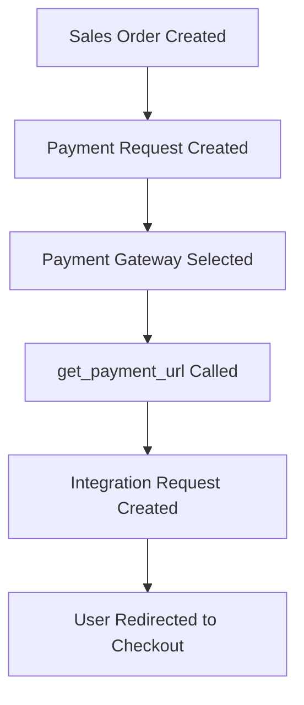
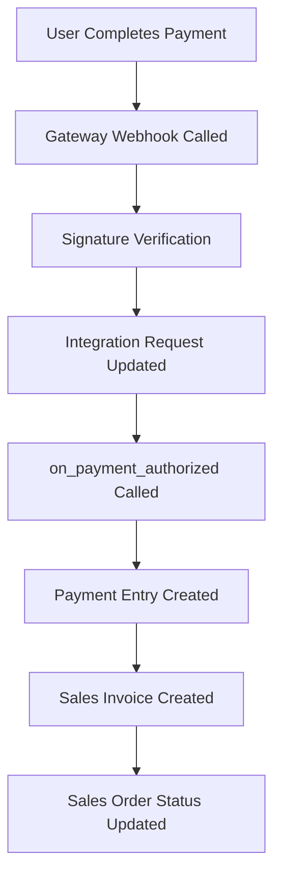
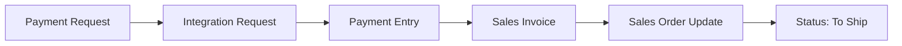

# Payment Gateways App - Architecture Documentation

This document provides a comprehensive mapping of the payment gateway architecture and integration with ERPNext.

## 📁 Directory Structure

```
payments/
├── payment_gateways/
│   ├── doctype/
│   │   ├── razorpay_settings/          # Razorpay payment gateway
│   │   ├── stripe_settings/            # Stripe payment gateway
│   │   ├── paytm_settings/             # Paytm payment gateway
│   │   ├── mpesa_settings/             # MPesa payment gateway
│   │   ├── yoco_settings/              # Yoco payment gateway
│   │   ├── payfast_settings/           # PayFast payment gateway
│   │   ├── paystack_settings/          # Paystack payment gateway
│   │   ├── paypal_settings/            # PayPal payment gateway
│   │   ├── braintree_settings/         # Braintree payment gateway
│   │   └── gocardless_settings/        # GoCardless payment gateway
│   ├── stripe_integration.py           # Stripe-specific integration
│   ├── payfast_itn.py                  # PayFast ITN handler
│   ├── paystack_webhook.py             # Paystack webhook handler
│   └── yoco_webhook.py                 # Yoco webhook handler
├── templates/
│   ├── pages/                          # Checkout page templates
│   │   ├── razorpay_checkout.html/py
│   │   ├── stripe_checkout.html/py
│   │   ├── paytm_checkout.html/py
│   │   ├── yoco_checkout.html/py
│   │   ├── payment-success.html
│   │   ├── payment-failed.html
│   │   └── payment-cancel.html
│   └── includes/                       # JavaScript checkout implementations
│       ├── razorpay_checkout.js
│       ├── stripe_checkout.js
│       ├── paytm_checkout.js
│       └── yoco_checkout.js
├── overrides/
│   └── payment_webform.py              # Web form payment integration
├── utils/
│   └── utils.py                        # Utility functions
└── payments/
    └── doctype/
        └── payment_gateway/             # Core payment gateway doctype
```

## 🔄 Payment Flow Architecture

### 1. Payment Request Creation Flow



### 2. Payment Processing Flow



### 3. ERPNext Integration Points



## 🏗️ Core Components

### Payment Gateway Settings (Base Pattern)

Each payment gateway follows this standard pattern:

```python
class PaymentGatewaySettings(Document):
    def validate(self):
        create_payment_gateway("Gateway Name")
        call_hook_method("payment_gateway_enabled", gateway="Gateway Name")
    
    def validate_transaction_currency(self, currency):
        # Validate supported currencies
        pass
    
    def get_payment_url(self, **kwargs):
        # Create Integration Request and return checkout URL
        integration_request = create_request_log(kwargs, service_name="Gateway")
        return get_url(f"./gateway_checkout?token={integration_request.name}")
    
    def create_request(self, data):
        # Process payment with gateway API
        pass
```

### Integration Request Lifecycle

1. **Created**: When `get_payment_url()` is called
2. **Queued**: When payment processing starts
3. **Authorized**: When payment is authorized but not captured
4. **Completed**: When payment is successfully processed
5. **Failed**: When payment fails
6. **Cancelled**: When payment is cancelled

### Payment Request Integration

The `PaymentRequest` doctype in ERPNext handles the complete payment lifecycle:

```python
def on_payment_authorized(self, status):
    """Called by payment gateway webhooks"""
    if status in ("Authorized", "Completed"):
        payment_entry = self.set_as_paid()
        if self.make_sales_invoice:
            self.make_invoice()  # Creates Sales Invoice from Sales Order
        return payment_entry
```

## 💳 Payment Gateway Implementations

### Razorpay Implementation

**Key Features:**
- Supports 100+ currencies
- Order-based payment flow
- Subscription support
- Webhook signature verification

**Flow:**
1. `create_order()` - Creates Razorpay order
2. Frontend integration with Razorpay.js
3. `authorize_payment()` - Processes webhook
4. `on_payment_authorized()` - Updates ERPNext

**Files:**
- `razorpay_settings.py` - Main controller
- `razorpay_checkout.html/py` - Checkout page
- `razorpay_checkout.js` - Frontend integration

### Stripe Implementation

**Key Features:**
- Global payment processing
- Minimum amount validation
- Multiple payment methods
- Strong currency support

**Flow:**
1. `create_charge_on_stripe()` - Direct charge creation
2. Immediate payment processing
3. `finalize_request()` - Handles response
4. `on_payment_authorized()` - Updates ERPNext

**Files:**
- `stripe_settings.py` - Main controller
- `stripe_checkout.html/py` - Checkout page
- `stripe_checkout.js` - Frontend integration

### Paytm Implementation

**Key Features:**
- India-focused payment gateway
- INR currency only
- Checksum-based security
- Transaction status verification

**Flow:**
1. `get_paytm_params()` - Generates payment parameters
2. `verify_transaction()` - Handles callback
3. `verify_transaction_status()` - Double verification
4. `finalize_request()` - Updates ERPNext

**Files:**
- `paytm_settings.py` - Main controller
- `paytm_checkout.html/py` - Checkout page

### MPesa Implementation

**Key Features:**
- Kenya-focused mobile payments
- STK Push integration
- Phone-based payments
- Real-time balance checking

**Flow:**
1. `generate_stk_push()` - Initiates mobile payment
2. `verify_transaction()` - Handles callback
3. Multiple payment support for large amounts
4. `on_payment_authorized()` - Updates ERPNext

**Files:**
- `mpesa_settings.py` - Main controller
- `mpesa_connector.py` - API integration
- `mpesa_custom_fields.py` - POS integration

### Yoco Implementation (Current Issues)

**Key Features:**
- South Africa-focused payment gateway
- ZAR currency support
- Card and digital wallet payments
- Webhook-based notifications

**Current Issues:**
1. Incomplete webhook handling
2. Missing Integration Request updates
3. Incomplete ERPNext integration
4. No proper error handling

## 🔧 ERPNext Integration Details

### Payment Request Workflow

1. **Creation**: From Sales Order, Sales Invoice, or Web Form
2. **Gateway Selection**: Based on Payment Gateway Account
3. **URL Generation**: Creates checkout URL with Integration Request token
4. **Payment Processing**: User completes payment on gateway
5. **Webhook Handling**: Gateway notifies system of payment status
6. **ERPNext Updates**: Payment Entry, Sales Invoice, and Sales Order updates

### Key ERPNext Methods

#### `on_payment_authorized(status)`
- Called by all payment gateways after successful payment
- Creates Payment Entry linking payment to Sales Order
- Generates Sales Invoice if `make_sales_invoice=True`
- Updates Sales Order status from "To Ship and Pay" to "To Ship"

#### `set_as_paid()`
- Creates Payment Entry with proper accounting entries
- Links payment to reference document (Sales Order/Invoice)
- Updates outstanding amounts
- Handles currency conversions

#### `create_payment_entry()`
- Creates detailed Payment Entry document
- Handles multi-currency transactions
- Sets proper accounting dimensions
- Links to reference documents

### Sales Order Integration

When a payment is completed:
1. Payment Entry is created and linked to Sales Order
2. If `make_sales_invoice=True`, Sales Invoice is auto-generated
3. Sales Order status changes:
   - From: "To Ship and Pay"
   - To: "To Ship" (if fully paid)
4. Outstanding amount is updated

## 🚨 Common Issues and Solutions

### Issue 1: Payment Not Reflecting in ERPNext
**Cause**: Webhook not calling `on_payment_authorized()`
**Solution**: Ensure webhook properly calls the method with correct status

### Issue 2: Sales Invoice Not Created
**Cause**: `make_sales_invoice` flag not set or method not called
**Solution**: Ensure Payment Request has `make_sales_invoice=True`

### Issue 3: Sales Order Status Not Updated
**Cause**: Payment Entry not properly linked
**Solution**: Verify Payment Entry creation and reference linking

### Issue 4: Integration Request Status Issues
**Cause**: Webhook not updating Integration Request status
**Solution**: Call `integration_request.update_status(data, "Completed")`

## 🛠️ Development Guidelines

### Adding New Payment Gateway

1. **Create Settings Doctype**: Follow existing pattern
2. **Implement Core Methods**:
   - `validate_transaction_currency()`
   - `get_payment_url()`
   - `create_request()`
3. **Create Checkout Templates**: HTML, Python, and JavaScript files
4. **Implement Webhook Handler**: For payment notifications
5. **Test Integration**: Verify complete ERPNext integration

### Testing Checklist

- [ ] Payment Request creation
- [ ] Checkout page rendering
- [ ] Payment processing
- [ ] Webhook handling
- [ ] Integration Request updates
- [ ] Payment Entry creation
- [ ] Sales Invoice generation
- [ ] Sales Order status update

## 📚 Reference Files

### Core Utilities
- `payments/utils/utils.py` - Core utility functions
- `payments/overrides/payment_webform.py` - Web form integration

### ERPNext Integration
- `erpnext/accounts/doctype/payment_request/payment_request.py` - Main Payment Request logic
- `webshop/webshop/doctype/override_doctype/payment_request.py` - Webshop overrides

### Templates
- `payments/templates/pages/payment_success.py` - Success page handler
- `payments/templates/pages/payment-success.html` - Success page template
- `payments/templates/pages/payment-failed.html` - Failure page template

This documentation provides a complete understanding of the payment gateway architecture and serves as a reference for implementing new gateways or fixing existing issues.
